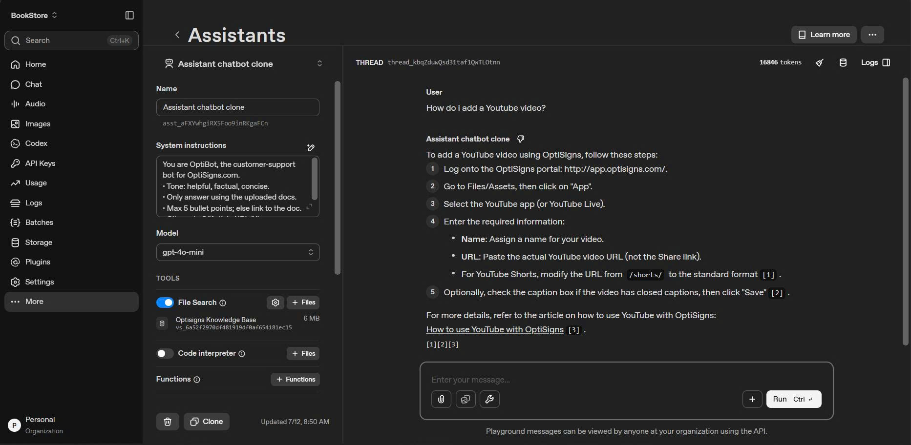

# Chatbot scraper uploader

A python project scrape articles via Zendesk API then convert them into markdown files. After that, upload them to OpenAI Playground's Vector Storage via OpenAI API

## Setup

Requirements

- Python 3.10
- Docker
- OpenAI API Key

Rename `.env.sample` file to `.env`

```env
OPENAI_API_KEY=<YOUR_OPENAI_API_KEY>
VECTOR_STORE_ID=<YOUR_VECTOR_STORE_ID>
ASSISTANT_ID=<YOUR_ASSISTANT_ID>
```
We'll three values from your OpenAI Playground settings:
* On the **API Keys** page, choose **Create new secret key** then copy your **secret key** to **OPEN_API_KEY**.
* On the **Storage** page, choose **Vector stores** tab and create new Vector store then copy your **Vector store's id** to **VECTOR_STORE_ID**.
* Click **More** to choose **Assistants** page. Create new assistant and copy your **Assistant's id**, which is below its name, to **ASSISTANT_ID**.

After setting things up, continue the following instruction so your Assistant can access the created Vector store:
1. Add system instructions for your bot with the following prompt:\
*You are OptiBot, the customer-support bot for OptiSigns.com.*\
*• Tone: helpful, factual, concise.*\
*• Only answer using the uploaded docs.*\
*• Max 5 bullet points; else link to the doc.*\
*• Cite up to 3 "Article URL:" lines per reply.*
2. Turn on **File Search**
3. Click **Add files** button and choose **Attach existing vector store** the choose your created Vector store


## Run Locally

```bash
docker build -t optibotclone .
docker run --rm --env-file .env -v "%cd%\data:/data" optibotclone
```

## Chunkin Strategy

No custom chunking strategy was used as the default settings provided by OpenAI's vector store performed sufficiently well for this project.

## Upload log

Logs: https://github.com/phathydra/chatbot-scraper-uploader/blob/main/logs/upload_log.json

## Daily Job

Runs once per day at 17:00 UTC (00:00 in Vietnam time) on Railway.

Logs: https://github.com/phathydra/chatbot-scraper-uploader/blob/main/logs/dailyjob_log.json \
(Log for daily run at 6:50 UTC for testing)


## Assistant Demo

